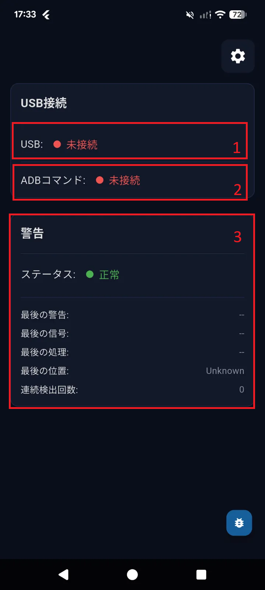
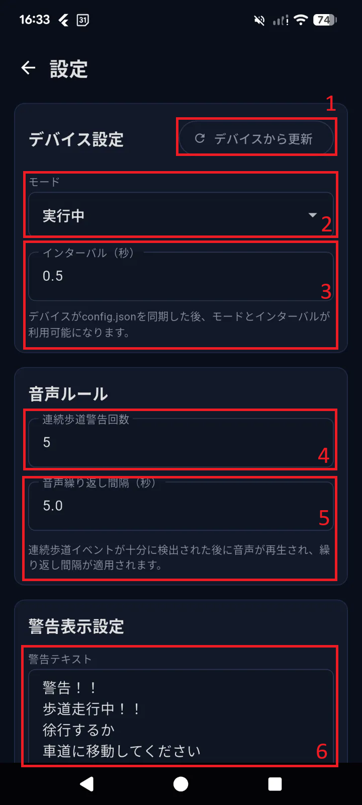
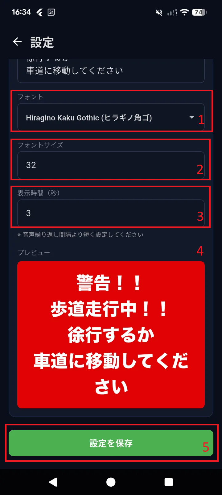
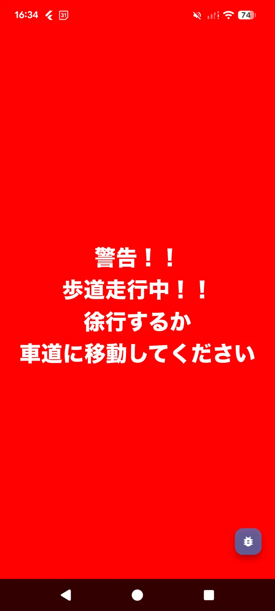

UI Design
================

Connection and Location Status
-----------------------------------

.. list-table:: **Status**
   :widths: 15 30 30
   :header-rows: 1

   * - Number
     - Desciption
     - Value
   * - 1
     - Physical USB Connection status
     - ``Connection``

       ``Disconnection``
   * - 2
     - ADB Connecttion status
     - ``Connection``

       ``Disconnection``
   * - 3
     - Location status
     - Status: ``Sidewark Alert`` and ``Normal``

       Log ghi nhận
      
       ``Thông báo gần nhất ``: Thời điểm gần nhất điện thoại phát âm thông báo

       `` Tín hiệu gần nhất``: Lần cuối cùng nhận thông tin vị trí xe đạp

       `` Xử lý gần nhất``: Thời điểm xử lý thông tin vị trí xe đạp (gần với thời điểm ``tín hiệu gần nhất``)

       `` Vị trí cuối cùng``: Vị trí cuối cùng của xe đạp được ghi nhận

       `` Số lần đi trên vỉa hè liên tục``: Số lần phát hiện xe đang di chuyển trên vỉa hè liên tiếp. Giá trị reset về ``0`` khi vị trí xe đạp chuyển về ``Road`` hoặc sau khi phát thông báo trên điện thoại.

Configuration
-------------------

.. list-table:: **Status**
   :widths: 15 30 30
   :header-rows: 1

   * - Number
     - Desciption
     - Value
   * - 1
     - Pull file config của AI Unit về lần đầu tiên. Sử dụng khi muốn biết config hiện tại trên AI Unit
     - Thông tin trả về sẽ được cập nhật tại mục 2 và 3.
   * - 2
     - Chọn mode hoạt động cho AI Unit
     - ``Unavailable``: AI Unit và ứng dụng điện thoại chưa được connect

       ``Running``: AI Unit sẽ được khởi động ngay sau khi cắm nguồn.

       ``Stop``: Dừng mọi hoạt động của AI Unit.
   * - 3
     - Cài đặt thời gian giữa 2 lần phát hiện vị trí xe đạp liên tiếp.
     - Unit: ``seconds``

       Min: 0.2
   * - 4
     - Số lần phát hiện xe đang di chuyển lên vỉa hè liên tiếp sẽ được phát cảnh báo
     - Datatype: ``number``

       Unit: ``times``
   * - 5
     - Thời gian giữa 2 lần phát âm cảnh báo liên tiếp. Thời gian này phải lớn hơn giá trị mục ``3``x``4``.
     - Unit: ``seconds``
   * - 6
     - Nội dung cảnh báo hiển thị trên màn hình điện thoại
     - Nội dung dạng text, tùy người dùng nhập vào

       Limit: 30 kí tự fullwitdh

.. list-table:: **Status**
   :widths: 15 30 30
   :header-rows: 1

   * - Number
     - Desciption
     - Value
   * - 1
     - Điều chỉnh font chữ cho text cảnh báo
     - Nhập liệu dạng lựa chọn. Các font đang support:

       MS Gothic (ＭＳ ゴシック)

       MS Mincho (ＭＳ 明朝)

       Meiryo (メイリオ)

       Yu Gothic (遊ゴシック)

       Yu Mincho (遊明朝)

       Hiragino Kaku Gothic (ヒラギノ角ゴ)
   * - 2
     - Điều chỉnh size text thông báo
     - Nhập liệu dạng điền thông tin
   * - 3
     - Thời gian hiển thị text thông báo
     - Unit: ``giây``
   * - 4
     - Text thông báo demo
     - Hình ảnh demo
   * - 5
     - Lưu thông tin, ứng dụng điện thoại sẽ apply toàn bộ setting
     - 

Error Notification
-----------------------

