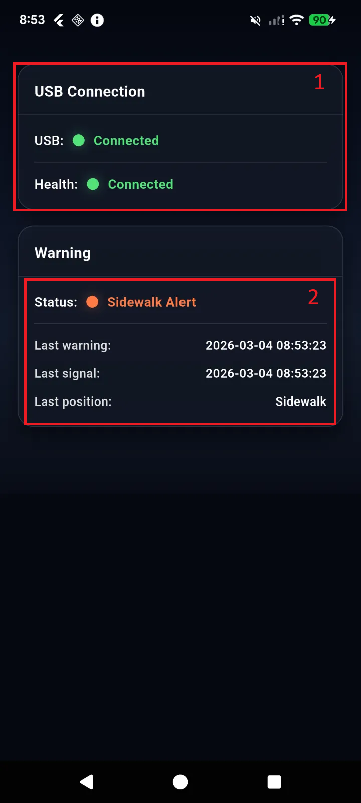

UX/UI Design
================

Connection and Location Status
-----------------------------------

.. image:: img/connection.png
   :alt: connection
   :width: 400px
   :align: center

.. list-table:: **Business Flow**
   :widths: 15 30 30
   :header-rows: 1

   * - Number
     - Desciption
     - Value
   * - 1: USB Connection
     - USB Connection status
     - ``Connection``

       ``Disconnection``
   * - 2: Warning
     - Location status
     - Status: ``Sidewark Alert`` and ``Normal``

       Log ghi nhận

Configuration
-------------------

.. image:: img/config.png
   :alt: config
   :width: 400px
   :align: center

.. list-table:: **Business Flow**
   :widths: 15 30 30
   :header-rows: 1

   * - Number
     - Desciption
     - Value
   * - 1: Mode
     - Chọn mode hoạt động cho AI Unit
     - ``Unavailable``: AI Unit và ứng dụng điện thoại chưa được connect

       ``Running``: AI Unit sẽ được khởi động ngay sau khi cắm nguồn

       ``Stop``: Dừng mọi hoạt động của AI Unit.
   * - 2: Interval
     - Cài đặt thời gian giữa 2 lần xử lý ảnh liên tiếp của AI Unit
     - Unit: ``seconds``

       Min: 0.2
   * - 3: Consecutive sidewalk warnings
     - Số lần phát hiện xe đang di chuyển lên vỉa hè liên tiếp sẽ được phát cảnh báo
     - Datatype: ``number``
   * - 4: Audio repeat interval (seconds)
     - Thời gian giữa 2 lần phát cảnh báo liên tiếp. Thời gian này phải là bội số của mục ``2`` và ``3``
     - Unit: ``seconds``